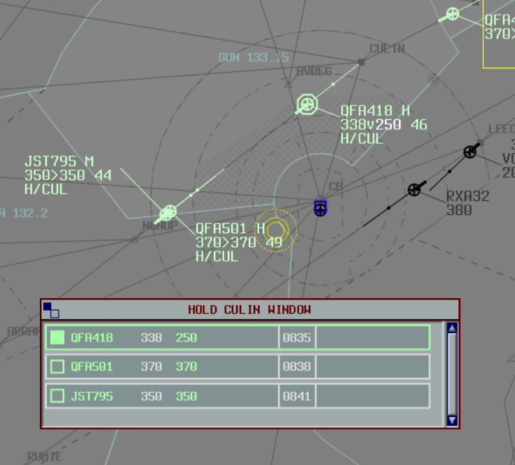
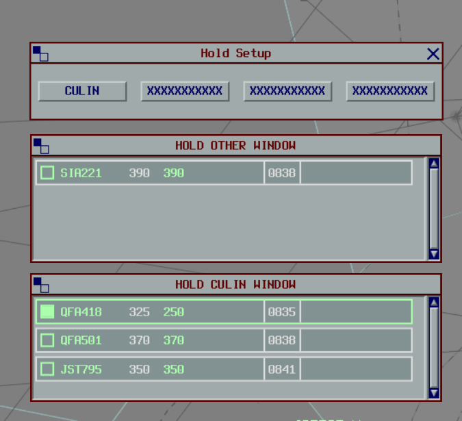

<h1 align="center">
  Hold List Plugin
</h1>

<h3 align="center">
  A vatSys plugin adding a Eurocat-style Hold Window.

  
  
  

  <!--  -->
</h3>

## Usage

To initiate a hold, enter the hold details into the Label Data.
The hold information should be formatted as `H/RIVET`, where `RIVET` is the name of the holding waypoint.
The waypoint name can be shortened to as little as three characters (e.g. `H/RIV`).

An exit time can be specified by appending it to the holding point name, e.g. `H/RIVET/29` to depart `RIVET` at 29-minutes past the hour.

The exit time can be adjusted directly from the list, or by modifying the label.

When the exit time is set, the ETO for all subsequent waypoints are adjusted to reflect the hold exit time.

The hold can be cancelled by removing the details from the Label Data, or by rerouting the flight past the holding point.

### Configuring Lists

Up to 4 holding lists can be configured. Click `Tools` > `Hold Setup` and enter the name of each waypoint.
Each of the configured waypoints will have their own hold list.

Any aircraft holding at a waypoint not configured with its own hold list will be placed in the `OTHER` list.

## Limitations

- The hold entry and exit times are not displayed in the vatSys strip due to limitations with the vatSys SDK
- Hold data is not extracted from the flight plan, the list will only display when the label data contains hold information.

## Roadmap

- [ ] Basic hold list
- [ ] Automatically update ETOs
- [ ] Display hold entry and exit times
- [ ] Inhibit alerts during hold